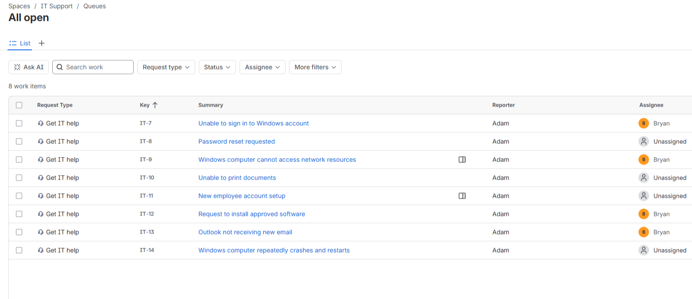
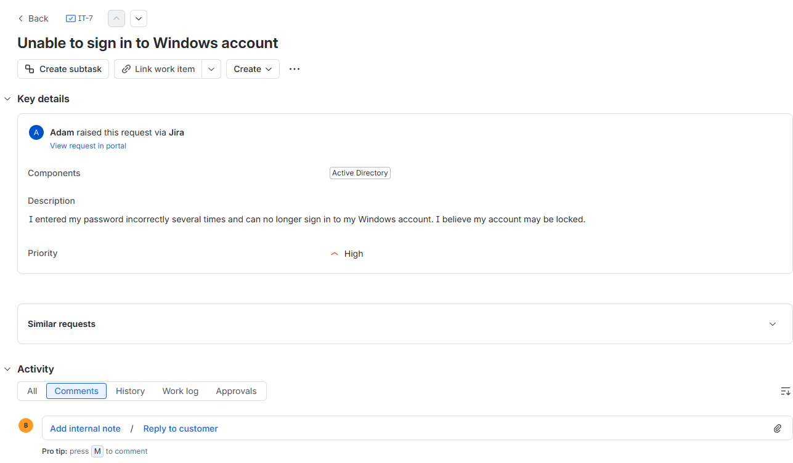
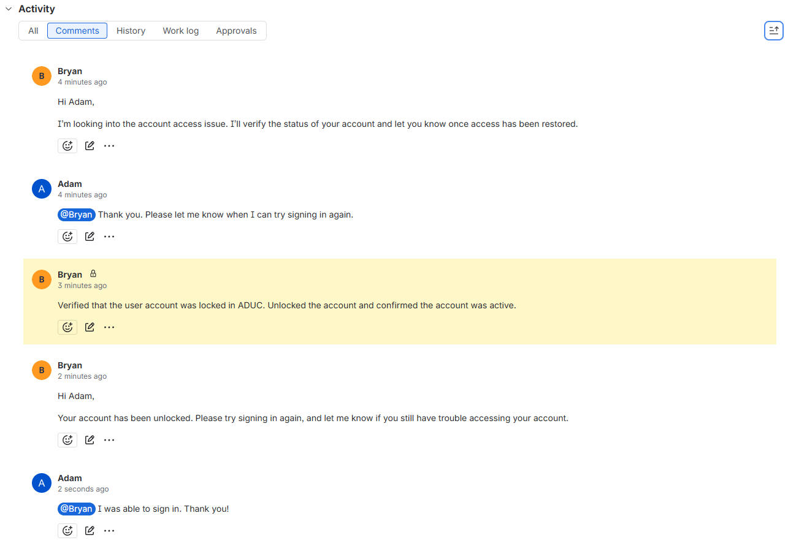
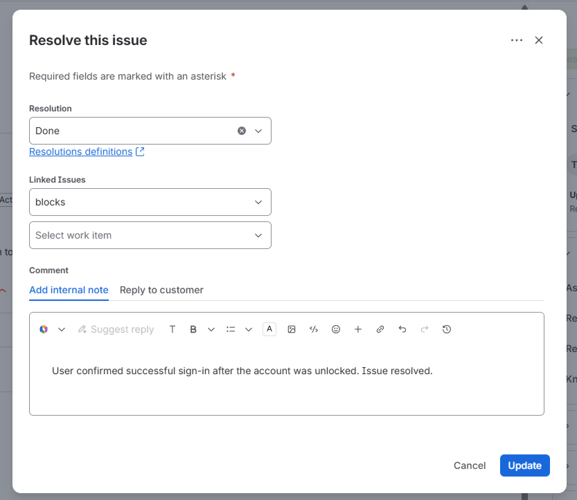
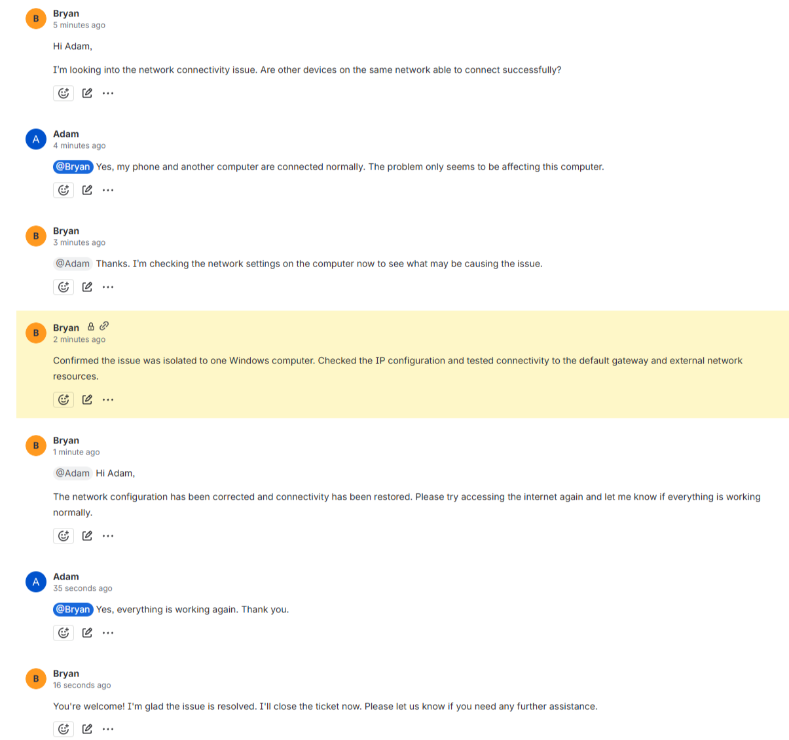
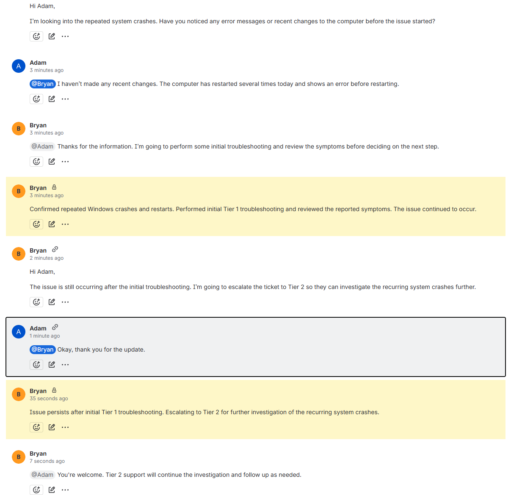
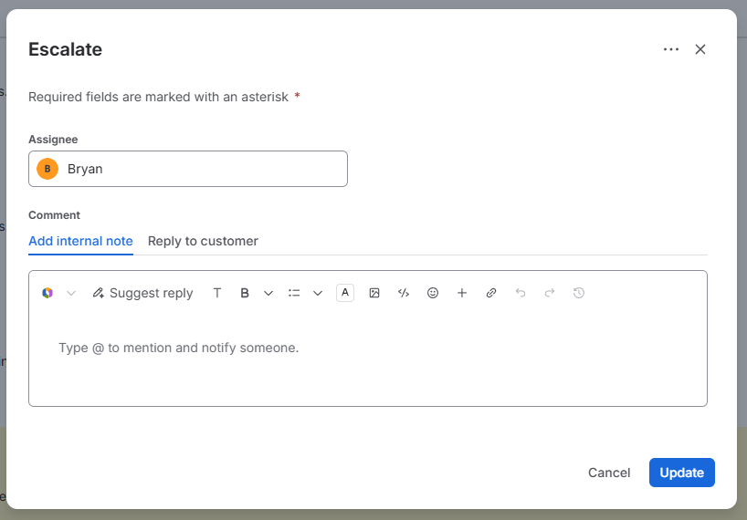
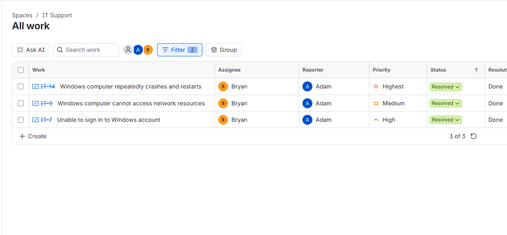

# Jira Ticketing System Home Lab

## Objective

The Jira Ticketing System Home Lab was created to build hands-on experience with common Tier 1 IT support requests. The lab documents practical work in Jira Service Management, including managing a support queue, communicating with users, documenting troubleshooting steps, resolving technical issues, and escalating unresolved issues to Tier 2 support.

### Skills Learned

- Created 8 simulated Tier 1 support tickets in Jira Service Management
- Resolved 2 support issues involving account access and network connectivity
- Escalated 1 unresolved Windows issue to Tier 2 after completing initial troubleshooting
- Documented troubleshooting activity using internal notes across 3 ticket scenarios
- Practiced customer communication through ticket responses

### Tools Used

- Jira Service Management

## Environment

| **Component** | **Detail** |
| ------------- | ---------- |
| Platform | Jira Service Management |
| Queue | Simulated Tier 1 help desk |
| Tickets | 8 in queue, 3 worked (2 resolved, 1 escalated) |
| Scenarios | Account lockout, network connectivity, Windows system issue |

## Lab Implementation

### Help Desk Queue

Created a simulated Tier 1 help desk queue containing common IT support requests.

*Tier 1 support queue in Jira Service Management.*

### Account Lockout

Resolved an account lockout, documented the fix, and confirmed user access was restored.

*Account lockout ticket submitted by the user.*

*Troubleshooting steps and account restoration documented on the ticket.*

*Ticket closed after confirming account access.*

### Network Connectivity Troubleshooting

Resolved a network connectivity issue by identifying the cause, applying the fix, and verifying connectivity was restored.

*Network troubleshooting and resolution documented on the ticket.*

### Tier 2 Escalation

Performed initial Tier 1 troubleshooting on a Windows issue and escalated it to Tier 2 for further investigation.

*Initial Tier 1 troubleshooting documented on the ticket.*

*Unresolved issue escalated to Tier 2 support.*

### Ticket Queue Review

Reviewed the help desk queue after completing the tickets.

*Final ticket statuses after resolution and escalation.*

## Outcome

The queue held 8 simulated tickets, 3 of which were worked end to end: 2 resolved through Tier 1 troubleshooting with user communication and internal documentation, and 1 escalated to Tier 2 after initial troubleshooting did not resolve the issue.
